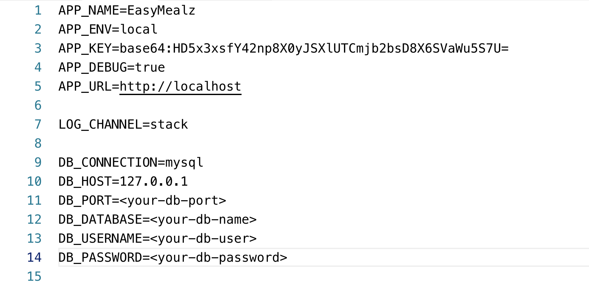

# EasyMealz
> A one stop shop for all the cooking enthusiasts

## Getting Started

These instructions will get you a copy of the project up and running on your local machine for development and testing purposes.

### Prerequisites

Before cloning the project to your local machine, make sure you have these installed:

- <a href="https://www.php.net/manual/en/install.php">PhP</a>
- <a href="https://getcomposer.org/doc/00-intro.md">Composer</a>

### Installation

To get your dev environment up and running, follow the below steps:

Open your terminal and execute the following commands

```
git clone git@github.com:2019-Winter-ITE-5330-0NA/project-kaizen.git
cd project-kaizen
composer install
```

#### Database Creation

<p>Make sure MySQL is running on your local machine. Import the <strong><a href="easymealz.sql">SQL Dump</a></strong> into your MySQL database.</p>
<p>Create a file named <strong>.env</strong> file in the project root and copy the contents of <a href=".env.example">.env.example</a> and add your database information to it. Your database info should look something like this.</p>



### Running

To run the project on your local machine, navgate to your project root folder in terminal and execute the following command:

```
php artisan serve
```

After starting the server, open your browser and go to <http://localhost:8000>.

### Built With

- <a href="PhP">PhP</a>: Language
- <a href="https://laravel.com/">Laravel</a>: Web Framework
- <a href="https://getcomposer.org/">Composer</a>: Dependency Mangement